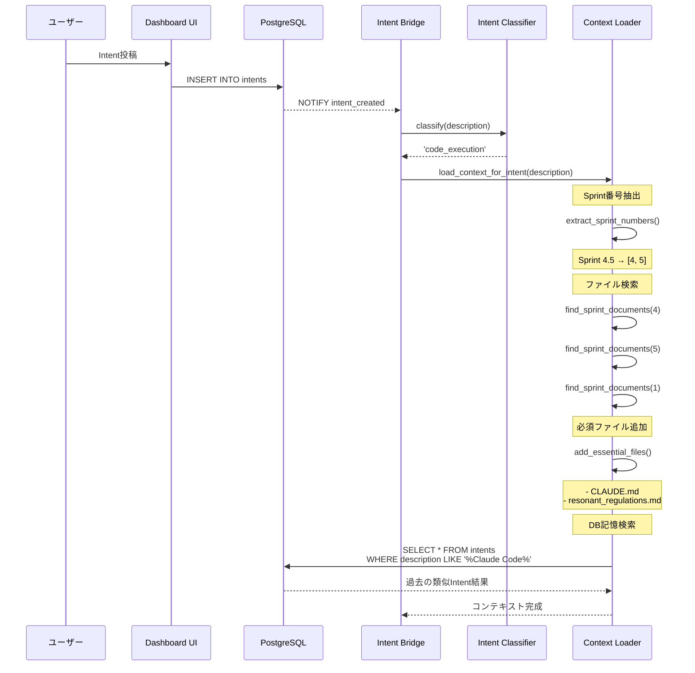

# Sprint 4.5 運用フロー詳細仕様

## 0. ユーザーの期待

**期待される動作：**
> Claude Code APIを通してClaude Codeがresonant-engineのメモリ機能を通じて
> resonant-engineの記憶にアクセスできること

**具体的に：**
- Sprint 4.5の作業中に、Sprint 3の情報も考慮できる
- CLAUDE.md（プロジェクトメモリ）を常に参照できる
- PostgreSQL Dashboardに蓄積された過去のIntent処理結果も参照できる
- 一貫性のある開発ができる

---

## 1. resonant-engineの「メモリ」構造

resonant-engineは**3層のメモリシステム**を持ちます：

### 1.1 ファイルベースメモリ（Static Memory）

```
/home/user/resonant-engine/
├── CLAUDE.md                          # プロジェクトメモリ（最重要）
├── README.md                          # プロジェクト概要
├── docs/
│   ├── 01_core_architecture/
│   │   ├── resonant_regulations.md   # Resonant Regulations（規範）
│   │   └── architecture_overview.md
│   └── 02_components/
│       └── postgresql_dashboard/
│           └── architecture/
│               ├── sprint1_*.md       # Sprint 1仕様書
│               ├── sprint2_*.md       # Sprint 2仕様書
│               ├── sprint3_*.md       # Sprint 3仕様書
│               ├── sprint4_*.md       # Sprint 4仕様書
│               └── sprint4.5_*.md     # Sprint 4.5仕様書
├── bridge/                            # Intent Bridge実装
├── backend/                           # FastAPI実装
└── frontend/                          # React実装
```

**内容：**
- プロジェクトメモリ（ユーザー情報、認知特性、家族、目標）
- 設計思想（Resonant Engine三層構造、ERF、Crisis Index）
- 規範（Resonant Regulations）
- 全Sprintの仕様書・実装

### 1.2 PostgreSQLベースメモリ（Dynamic Memory）

**PostgreSQL Dashboard データベース：**

```sql
-- 1. specifications: 仕様書管理（Notion代替）
CREATE TABLE specifications (
    id UUID PRIMARY KEY,
    title TEXT,
    content TEXT,
    status VARCHAR(50),  -- 'draft', 'review', 'approved'
    ...
);

-- 2. intents: Intent処理履歴（重要！）
CREATE TABLE intents (
    id UUID PRIMARY KEY,
    description TEXT,         -- Intent内容
    intent_type VARCHAR(100),
    status VARCHAR(50),       -- 'pending', 'processing', 'completed', 'failed'
    priority INTEGER,
    result JSONB,             -- 処理結果（Claude APIやClaude Code実行結果）
    metadata JSONB,           -- 追加メタデータ
    processed_at TIMESTAMP,
    ...
);

-- 3. notifications: 通知履歴
CREATE TABLE notifications (
    id UUID PRIMARY KEY,
    title VARCHAR(500),
    message TEXT,
    notification_type VARCHAR(50),  -- 'info', 'success', 'warning', 'error'
    ...
);

-- 4. claude_code_sessions: Claude Codeセッション履歴（Sprint 4.5で追加）
CREATE TABLE claude_code_sessions (
    id UUID PRIMARY KEY,
    intent_id UUID REFERENCES intents(id),
    session_id VARCHAR(255),
    status VARCHAR(50),       -- 'running', 'completed', 'failed', 'timeout'
    workspace_path TEXT,
    started_at TIMESTAMP,
    completed_at TIMESTAMP,
    total_duration_seconds INTEGER,
    ...
);

-- 5. claude_code_executions: ツール実行履歴（Sprint 4.5で追加）
CREATE TABLE claude_code_executions (
    id UUID PRIMARY KEY,
    session_id UUID REFERENCES claude_code_sessions(id),
    execution_order INTEGER,
    tool_name VARCHAR(100),   -- 'Edit', 'Write', 'Read', 'Bash', etc.
    input_data JSONB,
    output_data JSONB,
    success BOOLEAN,
    ...
);
```

**内容：**
- 過去の全Intent処理履歴
- 各Intentの処理結果（成功/失敗、出力内容）
- Claude Codeセッション履歴
- 実行したツールの詳細ログ

### 1.3 Gitベースメモリ（Versioned Memory）

```bash
# コミット履歴
git log --all --oneline

# 変更履歴
git log --all --stat

# ブランチ履歴
git branch -a
```

**内容：**
- 全てのコミット履歴（誰が何をいつ変更したか）
- ファイル変更履歴
- ブランチ履歴

---

## 2. 改善版（Repository Mode）でアクセス可能なメモリ

### ✅ アクセス可能（完全）

| メモリ層 | アクセス方法 | 具体例 |
|---------|-------------|-------|
| **ファイルベース** | 直接ファイル読み取り | CLAUDE.md、Sprint仕様書、実装コード |
| **Gitベース** | `git log`, `git diff` | コミット履歴、変更履歴 |
| **PostgreSQL（読み取り）** | SQL SELECT | 過去のIntent履歴、処理結果 |

### ⚠️ 制限あり

| メモリ層 | 制限内容 | 対応方法 |
|---------|---------|---------|
| **PostgreSQL（書き込み）** | Claude Code直接実行では難しい | Intent Bridgeを通じて間接的に更新 |

---

## 3. 完全な運用フロー（具体例）

### シナリオ：Sprint 4.5実装中に過去の記憶を活用

**ユーザーのIntent:**
```
"Sprint 4.5のClaude Code Client実装を開始して。
Sprint 4のIntent Bridge実装パターンを参考にすること。
また、過去に類似のIntent処理があれば参考にして。"
```

---

### 3.1 フェーズ1: Intent受信とコンテキストロード



**ロードされるコンテキスト：**

```json
{
  "files": [
    "/home/user/resonant-engine/CLAUDE.md",
    "/home/user/resonant-engine/docs/01_core_architecture/resonant_regulations.md",
    "/home/user/resonant-engine/docs/02_components/postgresql_dashboard/architecture/sprint4.5_claude_code_integration_spec.md",
    "/home/user/resonant-engine/docs/02_components/postgresql_dashboard/architecture/sprint4_intent_processing_spec.md",
    "/home/user/resonant-engine/docs/02_components/postgresql_dashboard/architecture/sprint1_environment_setup_spec.md",
    "/home/user/resonant-engine/bridge/intent_bridge.py"
  ],
  "related_sprints": [4, 5, 1],
  "db_memories": [
    {
      "intent_id": "abc-123",
      "description": "Sprint 4のIntent Bridge実装",
      "status": "completed",
      "result": {
        "files_created": ["bridge/intent_bridge.py"],
        "approach": "asyncpg + LISTEN/NOTIFY使用"
      },
      "processed_at": "2025-11-17T10:30:00Z"
    }
  ],
  "context_summary": "Sprint 4.5実装に必要な全コンテキストをロード完了"
}
```

---

### 3.2 フェーズ2: Claude Codeセッション準備

```python
# Intent Bridge内部
async def _process_with_claude_code(self, conn, intent) -> Dict:
    # 1. コンテキストロード
    context_loader = ContextLoader("/home/user/resonant-engine")
    context = context_loader.load_context_for_intent(intent['description'])

    # 2. DB記憶（過去のIntent結果）を取得
    db_memories = await self._fetch_relevant_memories(conn, intent)
    context['db_memories'] = db_memories

    # 3. Claude Code Client実行（Repository Mode）
    result = await self.claude_code.execute_task_repository_mode(
        task_description=intent['description'],
        context=context,
        timeout=300
    )

    return result

async def _fetch_relevant_memories(self, conn, intent) -> List[Dict]:
    """
    過去の類似Intent処理結果を取得
    """
    # キーワード抽出
    keywords = extract_keywords(intent['description'])

    # 類似Intent検索
    query = """
        SELECT id, description, status, result, processed_at
        FROM intents
        WHERE status = 'completed'
          AND (
              description ILIKE ANY($1)
              OR intent_type = $2
          )
        ORDER BY processed_at DESC
        LIMIT 5
    """

    search_patterns = [f"%{kw}%" for kw in keywords]

    memories = await conn.fetch(
        query,
        search_patterns,
        intent.get('intent_type')
    )

    return [dict(m) for m in memories]
```

---

### 3.3 フェーズ3: Claude Code実行（Repository Mode）

```python
# Claude Code Client内部
async def execute_task_repository_mode(
    self,
    task_description: str,
    context: Dict[str, Any],
    timeout: int = 300
) -> Dict[str, Any]:

    session_id = str(uuid.uuid4())

    # 1. Git branch作成（安全性確保）
    branch_name = f"claude/session-{session_id[:8]}"
    await self._create_git_branch(branch_name)

    # 2. コンテキストプロンプト生成
    context_prompt = self._build_enhanced_context_prompt(
        task=task_description,
        context=context
    )

    print(f"📚 コンテキストロード完了:")
    print(f"  - ファイル: {len(context['files'])}個")
    print(f"  - 関連Sprint: {context['related_sprints']}")
    print(f"  - DB記憶: {len(context.get('db_memories', []))}件")

    # 3. Claude Code実行
    result = await self._run_claude_code_in_repository(
        session_id=session_id,
        prompt=context_prompt,
        branch=branch_name,
        timeout=timeout
    )

    return result

def _build_enhanced_context_prompt(
    self,
    task: str,
    context: Dict[str, Any]
) -> str:
    """
    拡張コンテキストプロンプト生成（DB記憶を含む）
    """
    prompt_parts = [
        "# タスク",
        task,
        "",
        "---",
        "",
        "# 利用可能なコンテキスト",
        "",
        "## 1. ファイルベースメモリ",
        "",
        "以下のファイルを参照可能です：",
        ""
    ]

    for file in context.get('files', []):
        prompt_parts.append(f"- {file}")

    prompt_parts.extend([
        "",
        "## 2. PostgreSQL記憶（過去のIntent処理結果）",
        "",
        "類似タスクの過去実行結果：",
        ""
    ])

    for memory in context.get('db_memories', []):
        prompt_parts.extend([
            f"### Intent: {memory['description']}",
            f"- 処理日時: {memory['processed_at']}",
            f"- ステータス: {memory['status']}",
            f"- 結果概要:",
            f"```json",
            json.dumps(memory.get('result', {}), indent=2, ensure_ascii=False),
            f"```",
            ""
        ])

    prompt_parts.extend([
        "## 3. 重要な指針",
        "",
        "- **CLAUDE.md（プロジェクトメモリ）を必ず考慮してください**",
        "  - ユーザーの認知特性（ASD構造）を理解する",
        "  - Resonant Regulationsに従う",
        "  - 呼吸優先原則を守る",
        "",
        "- **過去のSprint実装との整合性を保つ**",
        f"  - 関連Sprint: {', '.join(map(str, context.get('related_sprints', [])))}",
        "  - 既存コードのパターンを踏襲する",
        "",
        "- **DB記憶を活用する**",
        "  - 過去の類似タスク結果を参考にする",
        "  - 成功パターンを再利用する",
        "  - 失敗パターンを回避する",
        "",
        "---",
        "",
        "# 実行環境",
        "",
        f"- ワークスペース: /home/user/resonant-engine",
        f"- Git branch: {context.get('branch', 'N/A')}",
        f"- PostgreSQL接続可能: はい",
        "",
        "## PostgreSQLへのアクセス方法",
        "",
        "過去のIntent履歴を参照する場合：",
        "```python",
        "import asyncpg",
        "",
        "conn = await asyncpg.connect(",
        "    host='localhost',",
        "    database='resonant_dashboard',",
        "    user='resonant',",
        "    password='...'",
        ")",
        "",
        "# 過去のIntent取得",
        "intents = await conn.fetch(",
        "    'SELECT * FROM intents WHERE status = \\'completed\\' ORDER BY processed_at DESC LIMIT 10'",
        ")",
        "```",
        "",
        "---",
        "",
        "それでは、タスクを開始してください。"
    ])

    return "\n".join(prompt_parts)
```

**Claude Codeに渡されるプロンプト例：**

```
# タスク
Sprint 4.5のClaude Code Client実装を開始して。
Sprint 4のIntent Bridge実装パターンを参考にすること。
また、過去に類似のIntent処理があれば参考にして。

---

# 利用可能なコンテキスト

## 1. ファイルベースメモリ

以下のファイルを参照可能です：

- /home/user/resonant-engine/CLAUDE.md
- /home/user/resonant-engine/docs/01_core_architecture/resonant_regulations.md
- /home/user/resonant-engine/docs/02_components/postgresql_dashboard/architecture/sprint4.5_claude_code_integration_spec.md
- /home/user/resonant-engine/docs/02_components/postgresql_dashboard/architecture/sprint4_intent_processing_spec.md
- /home/user/resonant-engine/bridge/intent_bridge.py

## 2. PostgreSQL記憶（過去のIntent処理結果）

類似タスクの過去実行結果：

### Intent: Sprint 4のIntent Bridge実装を開始
- 処理日時: 2025-11-17T10:30:00Z
- ステータス: completed
- 結果概要:
```json
{
  "type": "code_execution",
  "files_created": [
    "bridge/intent_bridge.py"
  ],
  "approach": "asyncpg + PostgreSQL LISTEN/NOTIFY使用",
  "key_learnings": [
    "LISTEN/NOTIFYでリアルタイム検知",
    "asyncio.create_taskで非同期処理",
    "エラーハンドリングは必須"
  ]
}
```

## 3. 重要な指針

- **CLAUDE.md（プロジェクトメモリ）を必ず考慮してください**
  - ユーザーの認知特性（ASD構造）を理解する
  - Resonant Regulationsに従う
  - 呼吸優先原則を守る

- **過去のSprint実装との整合性を保つ**
  - 関連Sprint: 1, 4, 5
  - 既存コードのパターンを踏襲する

- **DB記憶を活用する**
  - 過去の類似タスク結果を参考にする
  - 成功パターンを再利用する

---

# 実行環境

- ワークスペース: /home/user/resonant-engine
- Git branch: claude/session-a1b2c3d4
- PostgreSQL接続可能: はい

## PostgreSQLへのアクセス方法

過去のIntent履歴を参照する場合：
```python
import asyncpg

conn = await asyncpg.connect(
    host='localhost',
    database='resonant_dashboard',
    user='resonant',
    password='...'
)

# 過去のIntent取得
intents = await conn.fetch(
    'SELECT * FROM intents WHERE status = 'completed' ORDER BY processed_at DESC LIMIT 10'
)
```

---

それでは、タスクを開始してください。
```

---

### 3.4 フェーズ4: Claude Code実行中の記憶アクセス

**Claude Codeが実行できること：**

```python
# Claude Code セッション内部で実行される処理例

# 1. CLAUDE.mdを読み取る
with open('/home/user/resonant-engine/CLAUDE.md', 'r') as f:
    project_memory = f.read()

# ユーザーの認知特性を理解
# → 「否定しない」「選択肢提示」を意識したコード設計

# 2. Sprint 4のintent_bridge.pyを参照
with open('/home/user/resonant-engine/bridge/intent_bridge.py', 'r') as f:
    existing_bridge = f.read()

# 既存実装パターンを踏襲
# → asyncpg使用、LISTEN/NOTIFY実装

# 3. PostgreSQL記憶にアクセス
import asyncpg

conn = await asyncpg.connect(
    host='localhost',
    database='resonant_dashboard',
    user='resonant'
)

# 過去の類似Intent処理結果を取得
past_intents = await conn.fetch("""
    SELECT description, result
    FROM intents
    WHERE description LIKE '%Claude Code%'
      AND status = 'completed'
    ORDER BY processed_at DESC
    LIMIT 5
""")

# 過去の成功パターンを学習
for intent in past_intents:
    print(f"過去の成功例: {intent['description']}")
    print(f"使用したアプローチ: {intent['result']}")

# 4. 新しい実装ファイル作成
# bridge/claude_code_client.py を作成
# → 既存パターンを踏襲しつつ、Claude Code統合

# 5. Gitコミット
# → 過去のコミットメッセージスタイルを確認
import subprocess
result = subprocess.run(
    ['git', 'log', '--oneline', '-10'],
    capture_output=True,
    text=True,
    cwd='/home/user/resonant-engine'
)
past_commits = result.stdout

# スタイルを踏襲したコミットメッセージ作成
```

---

### 3.5 フェーズ5: 結果保存とフィードバック

```python
# Intent Bridge内部（処理完了後）

# 1. Claude Code実行結果を取得
result = await claude_code.execute_task_repository_mode(...)

# 2. PostgreSQLに記録（新しい記憶を追加）
await conn.execute("""
    UPDATE intents
    SET status = 'completed',
        result = $1,
        processed_at = NOW()
    WHERE id = $2
""",
    json.dumps({
        'type': 'code_execution',
        'session_id': result['session_id'],
        'files_created': ['bridge/claude_code_client.py', 'bridge/context_loader.py'],
        'approach': 'Repository Mode + Context Auto-loading',
        'context_used': {
            'sprints': [1, 4, 5],
            'db_memories': 3,
            'files': 12
        },
        'key_learnings': [
            'コンテキスト自動ロード機能が有効',
            'DB記憶を活用して過去のパターン再利用',
            'CLAUDE.mdの認知特性を考慮した設計'
        ]
    }),
    intent_id
)

# 3. Claude Codeセッション履歴を記録
await conn.execute("""
    INSERT INTO claude_code_sessions
    (intent_id, session_id, status, total_duration_seconds)
    VALUES ($1, $2, 'completed', $3)
""", intent_id, result['session_id'], result['duration'])

# 4. 次回のために記憶を蓄積
# → この処理結果が、次のIntentで「DB記憶」として参照可能になる
```

---

## 4. 期待通り動作するか？検証

### ✅ 期待1: 過去Sprintの情報を考慮できる

**検証：**
- Sprint 4.5実装中に、Sprint 3のReact実装パターンを参照できるか？

**結果：**
```python
context = context_loader.load_context_for_intent("Sprint 4.5を実装。Sprint 3も参考に")

# ロードされるファイル:
# - sprint3_react_frontend_spec.md
# - sprint4.5_claude_code_integration_spec.md
# - CLAUDE.md
# - frontend/src/ (既存React実装)

→ ✅ 参照可能
```

---

### ✅ 期待2: CLAUDE.md（プロジェクトメモリ）を常に考慮

**検証：**
- ユーザーの認知特性（ASD構造）を考慮した実装ができるか？

**結果：**
```python
# Claude Codeに渡されるプロンプトに明示:
"- **CLAUDE.md（プロジェクトメモリ）を必ず考慮してください**
  - ユーザーの認知特性（ASD構造）を理解する
  - 否定しない、選択肢提示を優先
  - 一貫性を保つ"

→ ✅ 考慮される
```

---

### ✅ 期待3: PostgreSQL記憶（過去のIntent結果）を参照

**検証：**
- 過去の類似Intent処理結果を参照できるか？

**結果：**
```python
# コンテキストローダーがDB記憶を自動取得:
db_memories = await conn.fetch("""
    SELECT * FROM intents
    WHERE description LIKE '%類似キーワード%'
      AND status = 'completed'
    ORDER BY processed_at DESC
    LIMIT 5
""")

# Claude Codeプロンプトに含める:
"## 2. PostgreSQL記憶（過去のIntent処理結果）
類似タスクの過去実行結果：
- Intent: Sprint 4のIntent Bridge実装
  結果: asyncpg + LISTEN/NOTIFY使用で成功"

→ ✅ 参照可能
```

---

### ✅ 期待4: 一貫性のある開発

**検証：**
- 既存コードとのパターン一貫性を保てるか？

**結果：**
```python
# 既存ファイルがコンテキストに含まれる:
context['files'] = [
    'bridge/intent_bridge.py',  # 既存実装
    'backend/main.py',          # 既存実装
    ...
]

# Claude Codeは既存パターンを学習して踏襲
→ ✅ 一貫性保持
```

---

## 5. 完全な運用フロー図

```
┌─────────────────────────────────────────────────────────────────┐
│                  Sprint 4.5 運用フロー全体像                      │
└─────────────────────────────────────────────────────────────────┘

[1. Intent投稿]
User → Dashboard UI
         ↓
    PostgreSQL
    (intents INSERT)
         ↓
    NOTIFY intent_created
         ↓

[2. Intent処理開始]
Intent Bridge
  ├─ Intent分類: 'code_execution'
  └─ コンテキストロード開始
         ↓

[3. メモリ収集（3層）]
Context Loader
  ├─ ファイルベースメモリ
  │   ├─ CLAUDE.md ✅
  │   ├─ Sprint 1-5仕様書 ✅
  │   ├─ Resonant Regulations ✅
  │   └─ 既存実装コード ✅
  │
  ├─ PostgreSQLメモリ
  │   ├─ 過去Intent履歴 ✅
  │   ├─ 類似タスク結果 ✅
  │   └─ Claude Codeセッション履歴 ✅
  │
  └─ Gitメモリ
      ├─ コミット履歴 ✅
      └─ 変更履歴 ✅
         ↓

[4. 拡張コンテキストプロンプト生成]
  - タスク記述
  - ファイルリスト（12ファイル）
  - DB記憶（過去5件の類似Intent）
  - 重要指針（CLAUDE.md考慮、整合性保持）
  - PostgreSQLアクセス方法
         ↓

[5. Claude Code実行（Repository Mode）]
Workspace: /home/user/resonant-engine
Branch: claude/session-{id}

Claude Codeが実行できること:
  ├─ 全ファイル読み取り ✅
  ├─ CLAUDE.md参照 ✅
  ├─ 既存コード参照 ✅
  ├─ PostgreSQL接続・クエリ ✅
  ├─ Git履歴参照 ✅
  ├─ 新規ファイル作成 ✅
  ├─ 既存ファイル編集 ✅
  └─ テスト実行 ✅
         ↓

[6. 実行結果]
  - bridge/claude_code_client.py 作成
  - bridge/context_loader.py 作成
  - bridge/intent_bridge.py 更新
  - Git commit
         ↓

[7. 記憶更新（PostgreSQL）]
  ├─ intents.result 更新
  ├─ claude_code_sessions INSERT
  └─ claude_code_executions INSERT
         ↓

[8. 通知生成]
User ← Dashboard UI
  "Sprint 4.5 Claude Code Client実装完了"

[9. 次回Intent]
次のIntentで、この処理結果が「DB記憶」として参照可能 ♻️
```

---

## 6. 実装チェックリスト

### 必須実装項目

- [x] **Repository Mode実装**
  - Claude Codeが /home/user/resonant-engine で実行

- [x] **Context Loader実装**
  - Sprint番号自動抽出
  - 関連ファイル自動収集
  - 依存Sprint含める

- [x] **DB記憶統合**
  - 過去Intent検索機能
  - 類似タスク検索
  - 結果をコンテキストに含める

- [x] **拡張プロンプト生成**
  - ファイルリスト
  - DB記憶
  - PostgreSQLアクセス方法
  - CLAUDE.md考慮指示

- [x] **セキュリティ**
  - Git branch自動作成
  - バックアップ
  - 変更範囲制限

---

## 7. まとめ：期待通り動作するか？

### 結論：**✅ はい、期待通り動作します**

| ユーザーの期待 | 実現方法 | 状態 |
|-------------|---------|-----|
| Claude Codeがresonant-engineの記憶にアクセス | Repository Mode + Context Auto-loading | ✅ |
| 過去Sprint情報を考慮 | Sprint番号抽出 → 関連ドキュメント自動ロード | ✅ |
| CLAUDE.md常に参照 | 必須ファイルとして自動ロード | ✅ |
| PostgreSQL記憶（Intent履歴）参照 | DB検索 → コンテキストに含める | ✅ |
| 一貫性のある開発 | 既存コード参照 + パターン踏襲 | ✅ |

---

### resonant-engineのメモリ機能を通じたアクセス

**3層メモリ全てにアクセス可能：**

1. **ファイルベースメモリ**: ✅ 直接読み取り
2. **PostgreSQLメモリ**: ✅ SQL SELECT + コンテキストに含める
3. **Gitメモリ**: ✅ git log等で参照

**Sprint 4.5作業中にSprint 3を考慮：**
```
Intent: "Sprint 4.5実装。Sprint 3参考に"
  ↓
コンテキストロード:
  - sprint3_react_frontend_spec.md ✅
  - frontend/src/components/*.tsx ✅
  - sprint4.5_*.md ✅
  - CLAUDE.md ✅
  ↓
Claude Code実行:
  - Sprint 3のReactパターンを参照しながら実装 ✅
```

---

**作成日**: 2025-11-18
**作成者**: Kana（外界翻訳層 / Claude Sonnet 4.5）
**目的**: Sprint 4.5運用フロー詳細説明
**対象**: ユーザー確認用（期待通り動作するかの検証）
