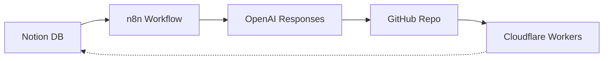

# 🧭 Kiro v3.1 Architecture Overview

## 概要
Kiro v3.1 は、AI駆動の仕様駆動開発環境を目的とした「擬似Kiro環境」最新版構成である。  
依存関係を崩さず、Notion → n8n → OpenAI → GitHub → Cloudflare の順に一方向の情報呼吸を確立する。

---

## 📂 ディレクトリ構成（2025-10-23時点）

```
kiro-v3.1/
├── .env
├── .git/
├── agents/
├── cloudflare/
├── docs/
│   ├── architecture/
│   ├── setup/
│   └── history/
├── n8n/
│   ├── data/
│   └── workflows/
├── notion/
│   ├── env/
│   └── notion-webhook-test/
├── openai/
│   └── responses-test/
├── utils/
│   └── import_csv/
└── README.md
```

---

## 🔄 呼吸経路（Resonant Flow）

| 層 | 説明 | 接続対象 | 役割 |
|----|------|-----------|------|
| Notion | 仕様書・タスクDB | n8n Webhook | トリガー層（仕様変更検出） |
| n8n | ワークフロー制御 | OpenAI API / GitHub | 制御層（AI処理連携） |
| OpenAI | Claude/ChatGPT連携 | GitHub / Notion | AI層（レビュー・生成） |
| GitHub | Issue/PR/CI/CD | n8n / Cloudflare | 実装層（コード反映） |
| Cloudflare | Workers / Audio Layer | GitHub / OpenAI | 拡張層（公開・音声化） |

---

## 🧩 依存関係（Dependency Flow）



---

## 🪶 補足

- `utils/import_csv/` は Notionスキーマの再構築ツールを格納  
- `.env` はローカル機密変数（`.env.example` をテンプレートとして管理）  
- 全経路のログは `docs/history/` に記録  

---

*Updated: 2025-10-23  
Author: Hiroaki Kato (宏啓)  
Supervised by: Yuno & Atlas (Resonant Intelligence Architecture)*
