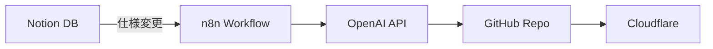

# Notion統合の現状と次のステップ

作成日: 2025-11-05

---

## 🔍 発見事項

### ✅ Notionの構造は設計通りに存在

エクスポートされたCSVから、4つのデータベースが確認できました：

1. **specs（仕様書DB）** - `2965f766048d80f08fbac1fb8e0c2772`
   - トリガー層として機能する設計
   - 「同期トリガー」列で同期対象を制御
   - 現在1件のデータ（Webhook疎通テスト用）

2. **tasks（タスクDB）** - `2955f766048d8030a03bcc65f877304f`
   - 実装タスクの管理
   - 「対象ページID」でspecsと紐付け
   - 状態: ToDo/Doing/Blocked/Done

3. **reviews（レビューDB）** - `2955f766048d80b88a6eee645ff068ba`
   - AIレビューの記録
   - レビュー種別: ユノ/アトラス/外部
   - 「対象ページID」でspecsと紐付け

4. **resonant_archive（アーカイブDB）** - `29b5f766048d80b4b09ee44ecf3322bf`
   - システムメトリクスの記録
   - **既に使用中**（`notion_archive_push.sh`が書き込み）

---

## ❌ 未実装だった部分

### Pythonによる統合コード

- `notion-client`パッケージはインストール済み
- しかし、**Pythonから読み書きするコードが存在しなかった**
- `notion_archive_push.sh`はシェルスクリプトでcurlを使用

### イベントストリームとの統合

- Notion同期が**イベントストリームに記録されていなかった**
- Backlog同期とも連携していなかった

---

## ✅ 今回実装したもの

### 1. `utils/notion_sync_agent.py`

Notion統合エージェント（完全実装）:

```python
agent = NotionSyncAgent()

# 同期トリガーが「Yes」の仕様書を取得
specs = agent.get_specs_with_sync_trigger()

# 特定の仕様書に紐付くタスクを取得
tasks = agent.get_tasks_for_spec(spec_page_id)

# 特定の仕様書に紐付くレビューを取得
reviews = agent.get_reviews_for_spec(spec_page_id)

# Resonant Archiveにメトリクスを書き込み
agent.write_archive(phase="test", metrics={...})
```

**特徴**:
- ✅ 統一イベントストリームに完全統合
- ✅ 因果関係を記録（parent_event_id）
- ✅ エラーハンドリング完備
- ✅ 4つのDB全てに対応

### 2. ドキュメント

- `docs/notion_setup_guide.md` - セットアップガイド
- `docs/env_template.txt` - 環境変数テンプレート

---

## 🎯 設計思想との整合性

### 設計段階の意図（Kiro v3.1 Architecture）



Notionは**トリガー層（第1層）**として最上位に位置。

### 現在の実装状況

```
第1層: Notion ❌ → ✅ (今回実装)
第2層: n8n ⚠️ (ワークフローはあるがactive: false)
第3層: OpenAI/Claude ⚠️ (統合未完成)
第4層: GitHub ✅ (Webhook受信は動作中)
第5層: Cloudflare ❓ (状況不明)
```

**結論**: Notionの統合により、設計思想の第1層が完成。

---

## 🔧 次に必要なこと

### Step 1: 環境変数の設定（5分）

`.env`ファイルを作成し、以下を設定:

```bash
# 1. Notion APIトークンを取得
#    https://www.notion.so/my-integrations

# 2. .envファイルを作成
nano /Users/zero/Projects/resonant-engine/.env

# 3. 以下を貼り付け（docs/env_template.txt を参照）
NOTION_TOKEN=secret_xxxxxxxxxxxxxxxxxxxxxxxxxxxx
NOTION_SPECS_DB_ID=2965f766048d80f08fbac1fb8e0c2772
NOTION_TASKS_DB_ID=2955f766048d8030a03bcc65f877304f
NOTION_REVIEWS_DB_ID=2955f766048d80b88a6eee645ff068ba
NOTION_ARCHIVE_DB_ID=29b5f766048d80b4b09ee44ecf3322bf
```

詳細: `docs/notion_setup_guide.md`

### Step 2: 動作確認（2分）

```bash
python3 utils/notion_sync_agent.py
```

現在はテストデータがないため0件と表示されるはず。

### Step 3: テストデータの作成（3分）

Notionのspecsデータベースで：
1. 新しいページを作成
2. **同期トリガー**: Yes に設定
3. **名前**: テスト仕様書
4. 保存

再度テスト実行で、1件検知されることを確認。

---

## 🚀 Phase 3への準備完了条件

### ✅ 完了済み
- [x] 統一イベントストリーム実装
- [x] observer_daemon統合
- [x] github_webhook統合
- [x] backlog_sync統合
- [x] **notion_sync実装**（今回）

### 🎯 Phase 3で実装予定

#### Option A: Notion + Backlog両対応（推奨）

```python
# daemon/spec_sync_daemon.py
# Notion と Backlog の両方を監視
# どちらか一方でも変更があればトリガー
```

**メリット**:
- 柔軟性が高い
- 既存のBacklog運用を継続可能
- 将来的にNotionに完全移行も可能

#### Option B: Notion優先

Notionをメイン、Backlogはサブとして扱う。

#### Option C: 統合ビュー

Notion と Backlog の情報を統合し、統一的に扱う。

---

## 📊 統合後のデータフロー

### 理想的なフロー

```
[ユーザー] Notionで仕様を更新
    ↓
EVT-001 (observation, source=notion_sync)
「同期トリガー: Yes」を検知
    ↓
EVT-002 (action, source=ai_agent)
AIが仕様を分析
    ↓
EVT-003 (action, source=notion_sync)
tasksに実装タスクを自動生成
    ↓
EVT-004 (observation, source=github_webhook)
実装完了後、GitHubからWebhook
    ↓
EVT-005 (action, source=ai_agent)
AIがコードレビュー
    ↓
EVT-006 (action, source=notion_sync)
reviewsにレビュー結果を書き込み
    ↓
EVT-007 (result, source=notion_sync)
specsの「構築ステータス」を「実稼働」に更新
```

**全てがイベントストリームで追跡可能**

---

## 🎉 まとめ

### Before（Phase 2完了時点）

```
記録基盤: ✅ 統一イベントストリーム
統合済み: observer_daemon, github_webhook, backlog_sync
未統合:   Notion ❌
```

### After（現在）

```
記録基盤: ✅ 統一イベントストリーム
統合済み: observer_daemon, github_webhook, backlog_sync, notion_sync ✅
準備完了: Phase 3（AI統合層）へ
```

---

## 💬 次のアクション

### あなたがすること

1. **Notion Integrationを作成**（5分）
   - https://www.notion.so/my-integrations
   - トークンを取得

2. **環境変数を設定**（3分）
   - `.env`ファイルを作成
   - `docs/env_template.txt`を参照

3. **動作確認**（2分）
   ```bash
   python3 utils/notion_sync_agent.py
   ```

4. **Phase 3の方向性を決定**
   - Option A: Notion + Backlog両対応（推奨）
   - Option B: Notion優先
   - Option C: 統合ビュー

### 私が対応できること

- 環境変数の設定支援
- 動作確認時のトラブルシューティング
- Phase 3の詳細設計
- 自動同期デーモンの実装

---

**Notionの統合準備が完了しました。環境変数を設定すれば、すぐに動作します。** 🎯

作成: 2025-11-05

